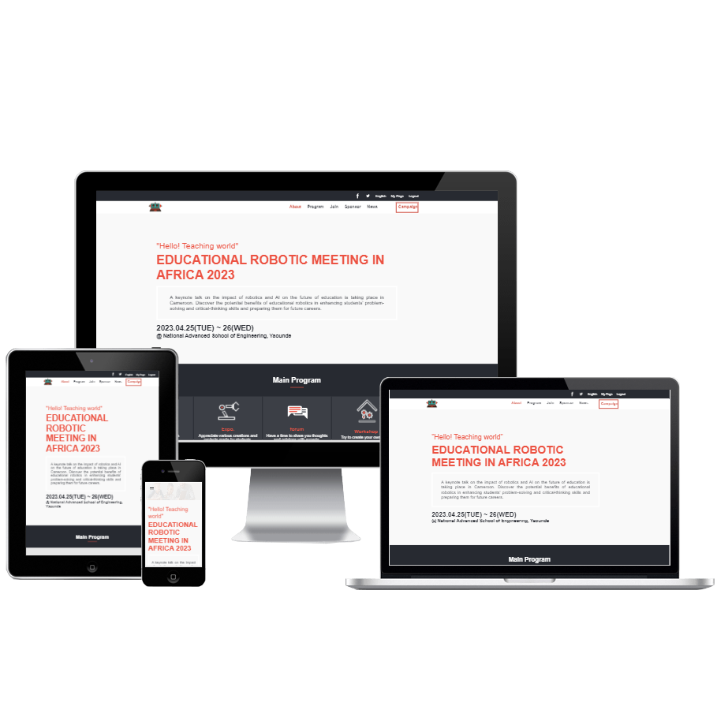

<a name="readme-top"></a>
<div align="center">
  
  
  <br/>
  
  <h2><b>Microverse First Capstone Project</b></h2>
</div>
<div align="center">
  
</div>


# 📗 Table of Contents
- [📖 About the Project](#about-project)
  - [🛠 Built With](#built-with)
    - [Tech Stack](#tech-stack)
    - [Key Features](#key-features)
  - [🚀 Live Demo](#live-demo)
- [💻 Getting Started](#getting-started)
  - [Setup](#setup)
  - [Prerequisites](#prerequisites)
  - [Install](#install)
  - [Usage](#usage)
  - [Run tests](#run-tests)
  - [Deployment](#triangular_flag_on_post-deployment)
- [👥 Authors](#authors)
- [🔭 Future Features](#future-features)
- [🤝 Contributing](#contributing)
- [⭐️ Show your support](#support)
- [🙏 Acknowledgements](#acknowledgements)
- [❓ FAQ (OPTIONAL)](#faq)
- [📝 License](#license)

# 📖 Meeting Booker <a name="Microverse-First-Capstone-Project"></a>

> This is my Microverse first capstone project. I created using HTML, CSS and JavaScript.
> Below is the link to the live version:
    https://momo-87.github.io/microverse-first-capstone-project/


## 🛠 Built With <a name="built-with"></a>
1- HTML.
2- CSS.
3- JavaScript
4- LINTERS.
5- [Loom video](https://www.loom.com/share/356606c55f0e4fd09eada440c256ae1f).

### Tech Stack <a name="tech-stack"></a>

<details>
  <summary>Client</summary>
  <ul>
    <li><a href="https://developer.mozilla.org/en-US/docs/Web/HTML">HTML</a></li>
    <li><a href="https://developer.mozilla.org/en-US/docs/Web/CSS">CSS</a></li>
    <li><a href="https://www.javascript.com/">JavaScript</a></li>
    <li><a href="https://www.loom.com/share/2ce37a7925314ac8a15d9b0606ca86e3">Loom video</a></li>
  </ul>
</details>


### Key Features <a name="key-features"></a>

- Added index.html file.
- Added about.html file.
- Added style.css file.
- Added about.css file
- Added script.js file.
- Added about.js file.


<p align="right">(<a href="#readme-top">back to top</a>)</p>


## 🚀 Live Demo <a name="live-demo"></a>

>  https://momo-87.github.io/microverse-first-capstone-project/

<p align="right">(<a href="#readme-top">back to top</a>)</p>


## 💻 Getting Started <a name="getting-started"></a>

To get a local copy up and running, follow these steps.

### Prerequisites

1. Web browser.
2. Code Editor.
3. Git-smc.

### Setup

Clone this repository to your desired folder:

Run this command:

```sh
  cd my-folder
  git clone https://github.com/momo-87/microverse-first-capstone-project.git
```

### Install

Run this command:

```sh
  cd my-project
  npm install
```

### Usage

To run the project, execute the following command:

Open index.html using live server extension.

### Run tests

Coming soon

### Deployment

Coming soon

<p align="right">(<a href="#readme-top">back to top</a>)</p>


## 👥 Authors <a name="authors"></a>

👤 Christian Romuald MOMO TONFACK

- GitHub: [@githubhandle](https://github.com/Momo-87)
- Twitter: [@twitterhandle](https://twitter.com/Momo_yde)
- LinkedIn: [LinkedIn](https://www.linkedin.com/in/christian-momo/)

<p align="right">(<a href="#readme-top">back to top</a>)</p>


## 🔭 Future Features <a name="future-features"></a>

- [ ] Add Header.
- [ ] Add Footer.
- [ ] Add more styles.

<p align="right">(<a href="#readme-top">back to top</a>)</p>


## 🤝 Contributing <a name="contributing"></a>
Original design idea by Cindy Shin in Behance.

Contributions, issues, and feature requests are welcome!

Feel free to check the [issues page](../../issues/).

<p align="right">(<a href="#readme-top">back to top</a>)</p>


## ⭐️ Show your support <a name="support"></a>

If you like this project just give it a star ⭐️.

<p align="right">(<a href="#readme-top">back to top</a>)</p>

## 🙏 Acknowledgments <a name="acknowledgements"></a>

<p>I would like to thank Microverse.</p>
<p>I would like to thank <a href = "https://www.behance.net/adagio07">Cindy Shin</a> the author of the <a href = "https://www.behance.net/gallery/29845175/CC-Global-Summit-2015">original design.</a></p>

<p align="right">(<a href="#readme-top">back to top</a>)</p>


## 📝 License <a name="license"></a>

This project is [MIT](./LICENSE) licensed.

<p align="right">(<a href="#readme-top">back to top</a>)</p>
